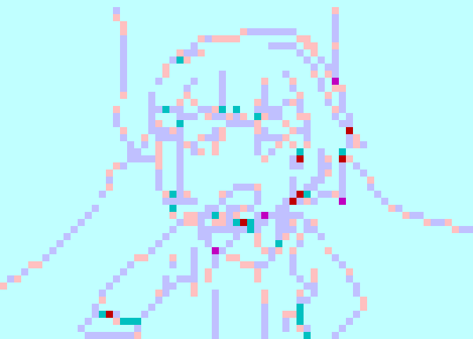
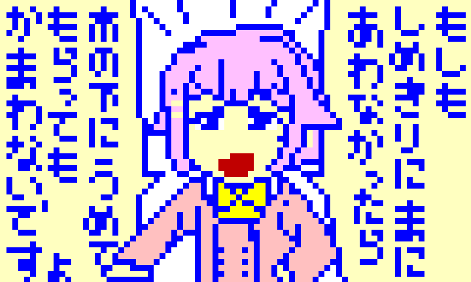
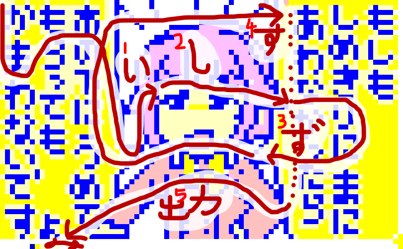

# 画像のPiet化のメイキングについて
# authored by murata


# はじめに

はじめましての人ははじめまして。
そうでない人はこんにちは、murataです。
のなさんのサークル「いっと☆わーくす」がコミケに当選したとのことで、
今回も寄稿させてもらいます。

今回の記事は、みんなが気になるであろうPietのメイキングについて書こうと思います。
作成するPietは、「涼しい顔で締め切りを破る「すずしい」と出力する輿水幸子」です。
更に難易度が上がりますが制限として、Pietは18色+白黒を使えるのを色数を
制限して5色+白で描こうと思います。
この画像を描こうと思った経緯は、僕のはてなブログ (chy72.hatenablog.com)に
書いてありますので、合わせてお読み下さい。


# 元絵を描く

\

まずは適当に絵を描きます。
この構図は、キルミーベイベーのやすなの有名なセリフ
「もし感動しなかったら木の下に埋めて貰っても構わないよ」のパロディです。


# Pietで扱いやすいように変換する

目的のPietに近いサイズに圧縮します。
FireAlpacaなどのお絵かきソフトがあれば簡単に出来るはずです。

\

次に、とりあえずPietが扱える20色に変換します。
コードは以下のとおりです。

```python
from PIL import Image
import sys
from colormath.color_objects import sRGBColor, LabColor
from colormath.color_conversions import convert_color
from colormath.color_diff import delta_e_cie2000

piet_colors = [
    "211", "221", "121", "122", "112", "212",
    "200", "220", "020", "022", "002", "202",
    "100", "110", "010", "011", "001", "101"
]

def piet(p):
    return [0, 192, 255][int(p)]

def calc_diff(r, g, b, rp, gp, bp):
    c1 = sRGBColor(r / 255.0, g / 255.0, b / 255.0)
    c2 = sRGBColor(piet(rp) / 255.0,
                    piet(gp) / 255.0,
                    piet(bp) / 255.0)
    c1 = convert_color(c1, LabColor)
    c2 = convert_color(c2, LabColor)
    delta = delta_e_cie2000(c1, c2)
    return delta

def to_piet_color(x, y, img):
    r, g, b = img.getpixel((x, y))
    pre_diff = 100000000
    decided_color = 0
    for (rp, gp, bp) in piet_colors:
        diff = calc_diff(r, g, b, rp, gp, bp)
        if diff < pre_diff:
            decided_color = (piet(rp), piet(gp), piet(bp))
            pre_diff = diff
    img.putpixel((x, y), decided_color)

if __name__ == "__main__":
    imgname = sys.argv[1]
    img = Image.open(imgname, 'r')
    for x in range(img.width):
        for y in range(img.height):
            to_piet_color(x, y, img)
    img.save("out.png")
```

colormathライブラリのdelta_e_cie2000 を使うと、
人間の視覚的な色の差を計算することが出来るので、それを利用します。
このコードを実行すると下の画像が得られます。

\

ここまでで原型ができたので、
これを元にして適当なPietのエディタを使用して見やすい形に
手動で変えます。

\

大体の原型がここまでで完成します。
この画像が一番綺麗な画像となります。


# 幸子を5色で表す

今回生成する目的画像は、「すずしい」と出力する「有彩5色+白」のPiet画像です。
理論上最低5色があればPietで実行できる命令は全て実行できるのですが、
どの5色を使うのかを決める必要があります。

今回はC++でコードを書いてどのようになるかを計算しました。
そのコード自体は前述の僕のはてなブログに書いてありますので省略します。
```
---- パターン1 ----
o o o x x x
o x x o x x
x x x x x x
---- パターン2 ----
o o x o x x
o x x x x x
x x o x x x
---- パターン3 ----
o o x x o x
o x x x x x
x x x o x x
---- パターン4 ----
o x x x x x
o o x o x x
x x o x x x
```
Pietでは18色(明度3段階(行)*色相6段階(列))使うのですが、
そのうちの5つで組み合わせて17命令を実行できるパターンを
探索して、この4パターンが判明しました。
(実際には、この4パターンの遷移、上下左右反転を含みます）
今回は、幸子の肌を表す「薄い黃」、髪を表す「薄い紫」、
服を表す「薄い赤」、輪郭を表す「濃い色」を使いたかったので、
パターン1を用いることにしました。

つまり、「薄い黃」「黃」「薄い赤」「薄い紫」「青」を用いることにしました。
まずは先程描いた幸子をこの5色で描いてみます。(まだPiet的意味は持っていません)

\


# Piet的意味を持たせる

これ以降、画像にPiet的意味を持たせるフェイズに入ります。
Piet的意味を強引に入れていくので、
これ以降生成される画像はPiet的意味を持つに従って劣化していきます。
Piet的情報量は画像の綺麗さとトレードオフの関係なのです。

さて、どのように「すずしい」というPiet的意味を持たせましょうか。
「すずしい」の各文字はUTF16の10進数表記で「12377,12378,12375,12356」となります。
12377のような大きな数字をスタックに積む簡単な方法は 一番近い二乗の数字を利用することです。
例えば、12356 であれば、 111 * 111 + 35 で表現できるので、
111 をスタックに積み、コピーして掛け算して 35を積んで足すだけで表現できます。
111をスタックに積むには、111のサイズのコーデルが必要なので、
今回の絵を鑑みて、セリフの部分で頑張ればいいということがなんとなく分かります。
よって、方針としては、左のセリフ部分で 12356を作成し、
コピーして差の分を加える…ということを繰り返すということが見えてきます。
12356 を作成すれば、コピーして21を積んで足すだけで12375を作成することができます。

今回は黒を使えないということで方向転換がだいぶ難しいので、
いっそポインターの赴くままに臨機応変にPietにしていきました。
文字を出力するためには 「黃」->「薄い赤」の遷移が必要で、
それを不自然無く満たす場所は幸子のリボンであるので、そこを最後に
通るようにということを考えながら描きました。
黒を使わずに終了するには、一面白の行と列が必要なので、
それを不自然無くおけるところは画面の端なので、
最後には画面の端に行けるようにということも考慮しながら描きました。
コツとしては、白を上手く使って実行する命令を制御すること、
不自然な色を使う必要が出てきた場合は、なるべく端っこで実行することで
絵全体としての品質を損なわないように意識することが挙げられます。

結果として、以下のようなPietを作成することができました。

\

移動の概略は、以下のような感じです。

\


# 最後に

元の絵を描いて、それを徐々にPietにしていくという方法を
とると、ある程度簡単にきれいなPietを作成することができます。
最低限のPietの知識は必要ですが、ぜひ皆さんも
画像をPiet化して裏の意味を持たせる遊びをしてみると楽しいと思います。
この記事を読んでくださって、ありがとうございました。